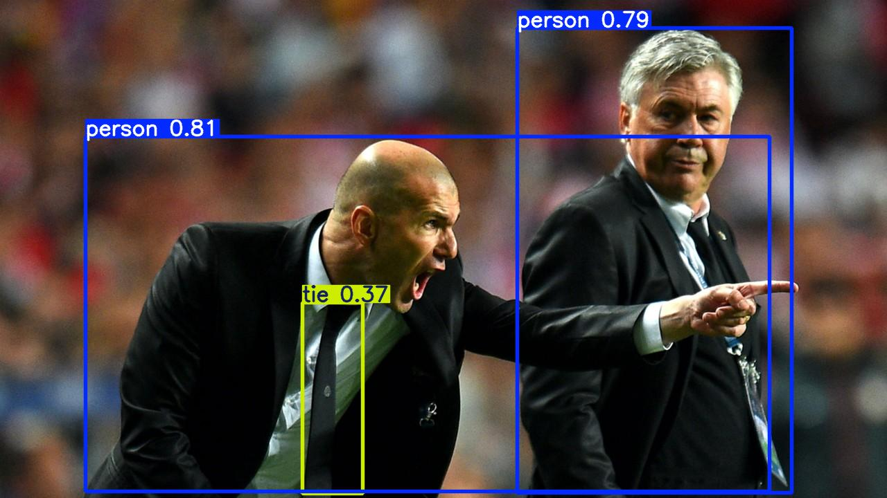
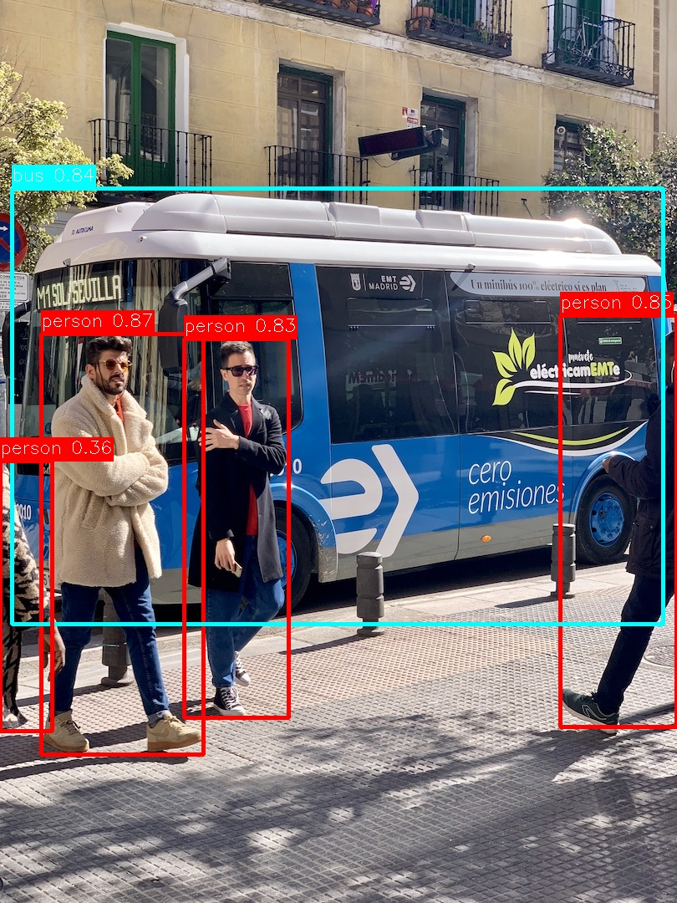

# YOLO 객체 탐지 시스템

YOLO (You Only Look Once) 모델을 활용한 실시간 객체 탐지 실험 시스템

## 프로젝트 구조

```
yolo/
├── docs/                       # 문서
│   └── architecture.md         # 아키텍처 설계 문서
├── src/                        # 소스 코드
│   ├── config.py              # 설정 관리
│   ├── data/                  # 데이터 계층
│   │   ├── loader.py          # 이미지 로딩
│   │   └── preprocessor.py    # 전처리
│   ├── model/                 # 모델 계층
│   │   └── detector.py        # YOLO 탐지기
│   └── output/                # 출력 계층
│       ├── visualizer.py      # 시각화
│       └── exporter.py        # 결과 저장
├── notebooks/                  # Jupyter 노트북
│   └── 01_basic_detection.ipynb
├── data/                       # 데이터
│   ├── images/                # 입력 이미지
│   ├── results/               # 탐지 결과
│   └── samples/               # 샘플 데이터
├── models/                     # 모델 가중치
│   └── weights/
├── tests/                      # 테스트
├── requirements.txt            # 패키지 의존성
└── README.md                   # 본 문서
```

## 설치

### 1. 가상환경 생성 (권장)

```bash
python -m venv venv
source venv/bin/activate  # Linux/Mac
# or
venv\Scripts\activate     # Windows
```

### 2. 의존성 설치

```bash
pip install -r requirements.txt
```

### 3. YOLO 모델 다운로드

처음 실행 시 자동으로 다운로드됩니다. 수동 다운로드:

```bash
# YOLOv8 모델
yolo download model=yolov8n.pt  # nano (가장 빠름)
yolo download model=yolov8s.pt  # small
yolo download model=yolov8m.pt  # medium
yolo download model=yolov8l.pt  # large
yolo download model=yolov8x.pt  # xlarge (가장 정확)
```

## 빠른 시작

### Python 스크립트

```python
from src.config import PRESET_CONFIGS
from src.data.loader import DataLoader
from src.model.detector import YOLODetector
from src.output.visualizer import Visualizer

# 1. 설정 및 모델 초기화
config = PRESET_CONFIGS["fast"]
detector = YOLODetector(config)

# 2. 이미지 로딩
loader = DataLoader()
image = loader.load_image("path/to/image.jpg")

# 3. 객체 탐지
detections = detector.predict(image)

# 4. 시각화
visualizer = Visualizer()
visualizer.show(image, detections)
```

### Jupyter 노트북

```bash
jupyter notebook notebooks/01_basic_detection.ipynb
```

## 주요 기능

### 1. 모델 설정

사전 정의된 설정:

```python
from src.config import PRESET_CONFIGS

# 빠른 속도
config = PRESET_CONFIGS["fast"]       # YOLOv8n

# 균형잡힌 성능
config = PRESET_CONFIGS["balanced"]   # YOLOv8s

# 높은 정확도
config = PRESET_CONFIGS["accurate"]   # YOLOv8m
```

커스텀 설정:

```python
from src.config import YOLOConfig

config = YOLOConfig(
    model_name="yolov8n",
    conf_threshold=0.25,
    iou_threshold=0.45,
    img_size=640,
)
```

### 2. 단일 이미지 탐지

```python
from src.model.detector import YOLODetector

detector = YOLODetector(config)
detections = detector.predict("image.jpg")

for det in detections:
    print(det)
```

### 3. 배치 처리

```python
# 여러 이미지 한 번에 처리
images = ["img1.jpg", "img2.jpg", "img3.jpg"]
batch_detections = detector.predict_batch(images)
```

### 4. 결과 시각화

```python
from src.output.visualizer import Visualizer

visualizer = Visualizer(line_thickness=2)

# matplotlib으로 표시
visualizer.show(image, detections)

# 여러 이미지 비교
visualizer.create_comparison(images, batch_detections)

# 요약 통계
visualizer.print_detection_summary(detections)
```

### 5. 결과 저장

```python
from src.output.exporter import ResultExporter

exporter = ResultExporter(output_dir="data/results")

# 이미지 저장
exporter.save_image(annotated_image)

# JSON 저장
exporter.save_detections_json(detections)

# 텍스트 저장 (YOLO 형식)
exporter.save_detections_txt(detections, image.shape, format="yolo")

# 요약 보고서
exporter.create_summary_report(batch_detections)
```

## 성능

| 모델 | 크기 | mAP | 속도 (GPU) | 용도 |
|------|------|-----|------------|------|
| YOLOv8n | 6.2MB | 37.3% | ~200 FPS | 실시간, 엣지 디바이스 |
| YOLOv8s | 22MB | 44.9% | ~150 FPS | 균형잡힌 성능 |
| YOLOv8m | 52MB | 50.2% | ~100 FPS | 높은 정확도 |
| YOLOv8l | 87MB | 52.9% | ~70 FPS | 전문 분석 |
| YOLOv8x | 136MB | 53.9% | ~50 FPS | 최고 정확도 |

*RTX 3090 기준, 640x640 이미지

## 지원 클래스

COCO 데이터셋 80개 클래스:
- 사람, 동물 (사람, 고양이, 개, 새 등)
- 차량 (자동차, 버스, 트럭, 자전거 등)
- 실내 물체 (의자, 테이블, TV, 노트북 등)
- 음식 (사과, 바나나, 샌드위치 등)
- 기타 일상 물체

전체 클래스 목록은 모델 정보에서 확인:

```python
detector.get_model_info()['class_names']
```

## 탐지 결과 예시

### 샘플 이미지 탐지

#### Zidane 이미지


- 탐지 객체: 2명의 사람, 1개의 넥타이
- 신뢰도: 0.81 (사람), 0.79 (사람), 0.37 (넥타이)

#### Bus 이미지


- 탐지 객체: 4명의 사람, 1대의 버스
- 신뢰도: 평균 0.748

## 예제

### 예제 1: 웹캠 실시간 탐지

```python
import cv2

cap = cv2.VideoCapture(0)

while True:
    ret, frame = cap.read()
    if not ret:
        break

    detections = detector.predict(frame)
    annotated = visualizer.draw_detections(frame, detections)

    cv2.imshow('YOLO Detection', annotated)

    if cv2.waitKey(1) & 0xFF == ord('q'):
        break

cap.release()
cv2.destroyAllWindows()
```

### 예제 2: 디렉토리 일괄 처리

```python
from pathlib import Path

loader = DataLoader()
images = loader.load_from_directory("data/images", max_images=100)

batch_detections = detector.predict_batch(images)

exporter.save_batch_results(images, batch_detections)
```

## 문제 해결

### GPU 메모리 부족

- 더 작은 모델 사용 (yolov8n)
- 이미지 크기 줄이기 (`img_size=320`)
- 배치 크기 줄이기

### 낮은 정확도

- 더 큰 모델 사용 (yolov8m, yolov8l)
- 신뢰도 임계값 조정 (`conf_threshold=0.2`)
- 이미지 품질 개선

### 느린 추론 속도

- GPU 활성화 확인
- 더 작은 모델 사용
- FP16 활성화 (`half=True`)
- 이미지 크기 줄이기

## 개발

### 테스트 실행

```bash
pytest tests/
```

### 코드 포맷팅

```bash
black src/ tests/
```

### 타입 체크

```bash
mypy src/
```

## 참고 자료

- [Ultralytics YOLO](https://docs.ultralytics.com/)
- [YOLOv8 Paper](https://arxiv.org/abs/2305.09972)
- [COCO Dataset](https://cocodataset.org/)

## 라이선스

MIT License

## 기여

이슈와 풀 리퀘스트를 환영합니다!

## 버전

- **v1.0.0** (2025-10-01): 초기 릴리스
  - 기본 탐지 파이프라인
  - 시각화 및 결과 저장
  - 배치 처리 지원
